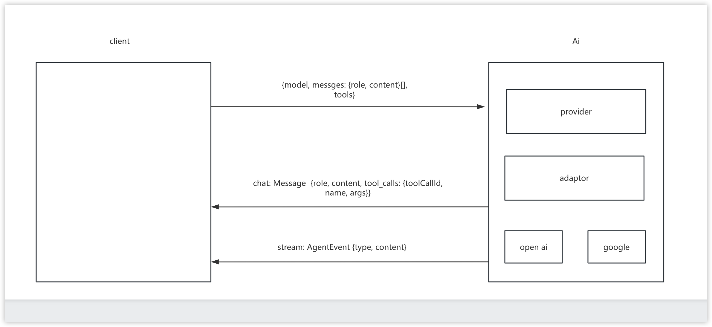

# 已实现的架构草图

## event （严格按照 input-thought-action-observation-output）
  turn 1:
  - input: InputEvent
  - output: ThoughtEvent | ActionEvent | ErrorEvent

  turn 2:
  - input: InputEvent | ThoughtEvent | ActionEvent | ObservationEvent
  - output: OutPutEvent

## provider
  - 内部适配器模式抹平各厂商差异，工厂模式注册，外部通过 createClient 的 provider 去查找。

## tool
  - 我有哪些 tool，长什么样子（作用，参数，名字）。
  - Ai 告诉我该调用哪些 tool, 参数是什么。
