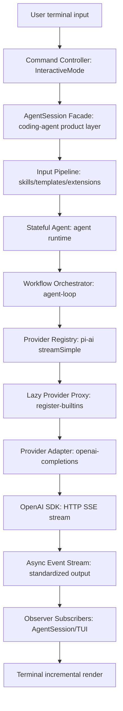
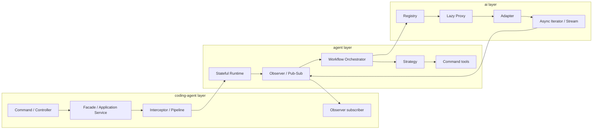
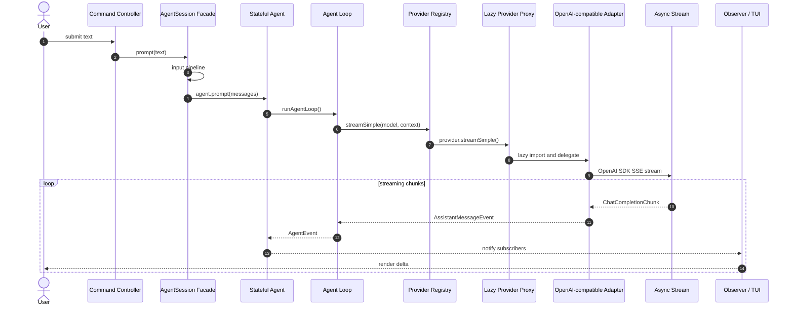

# 输入到输出流程中的架构模式

本文从一次终端输入开始，分析它到模型输出过程中经过的主要架构模式。范围集中在三层：

```text
CLI / coding-agent
  -> agent / agent-loop
  -> ai / provider
```

## 1. 总览

一次用户输入不是直接调用模型。它会先经过 CLI 产品层处理，再进入 agent runtime，最后由 ai 层路由到具体 provider。



主链路可以概括为：

```text
User input
  -> Command / Controller
  -> AgentSession Facade
  -> Skills/Templates/Extensions Pipeline
  -> Stateful Agent
  -> Agent Loop Orchestrator
  -> Provider Registry
  -> Lazy Provider Proxy
  -> Provider Adapter
  -> OpenAI SDK HTTP SSE stream
  -> pi-ai event stream
  -> agent event stream
  -> TUI render
```

## 2. 模式分布图



## 3. CLI 输入层：Command / Controller

### 阶段

```text
用户输入
  -> InteractiveMode.onSubmit()
  -> AgentSession.prompt()
```

### 位置

```text
packages/coding-agent/src/modes/interactive/interactive-mode.ts
packages/coding-agent/src/core/agent-session.ts
```

### 为什么这样设计

终端输入不一定是模型 prompt。它可能是：

- slash command
- bash command
- session command
- model/settings command
- extension command
- 普通用户 prompt

因此 CLI 层需要先做输入分类和命令分发。

### 核心伪代码

```ts
async function onSubmit(text: string) {
	if (isBuiltinCommand(text)) {
		return runBuiltinCommand(text);
	}

	if (isBashCommand(text)) {
		return runBashCommand(text);
	}

	return session.prompt(text);
}
```

## 4. AgentSession：Facade / Application Service

### 阶段

```text
InteractiveMode
  -> AgentSession.prompt()
  -> Agent.prompt()
```

### 位置

```text
packages/coding-agent/src/core/agent-session.ts
```

### 为什么这样设计

底层 `Agent` 应该保持通用，不应该知道 CLI 产品层的复杂性。

`AgentSession` 把这些产品能力聚合起来：

- skills
- prompt templates
- extensions
- auth
- model registry
- tools
- compaction
- session persistence
- TUI event bridge

它是 coding-agent 和 agent-core 之间的门面。

### 核心伪代码

```ts
class AgentSession {
	async prompt(text: string) {
		text = await runExtensionInputHooks(text);
		text = expandSkillCommand(text);
		text = expandPromptTemplate(text);

		const messages = [
			createUserMessage(text),
			...pendingNextTurnMessages,
		];

		this.agent.state.systemPrompt = buildSystemPrompt({
			skills,
			tools,
			contextFiles,
			customPrompt,
		});

		await this.agent.prompt(messages);
	}
}
```

## 5. Skills / Templates / Extensions：Interceptor + Pipeline

### 阶段

```text
用户文本
  -> extension input hook
  -> skill command expansion
  -> prompt template expansion
  -> before-agent-start hook
  -> AgentMessage
```

### 位置

```text
packages/coding-agent/src/core/agent-session.ts
```

### 为什么这样设计

skills 和 templates 本质上是 prompt 级能力。它们改变的是模型看到的文本和 system prompt，而不是 provider 实现。

extensions 需要机会拦截、改写或处理输入，因此输入进入 agent 前要经过 pipeline。

### 核心伪代码

```ts
async function preparePrompt(text: string) {
	const inputResult = await extensionRunner.emitInput(text);
	if (inputResult.action === "handled") {
		return undefined;
	}
	if (inputResult.action === "transform") {
		text = inputResult.text;
	}

	text = expandSkillCommand(text);
	text = expandPromptTemplate(text);

	const beforeStart = await extensionRunner.emitBeforeAgentStart(text);

	return {
		userMessage: createUserMessage(text),
		systemPrompt: beforeStart.systemPrompt ?? baseSystemPrompt,
		extraMessages: beforeStart.messages ?? [],
	};
}
```

## 6. Agent：Stateful Runtime / State Machine

### 阶段

```text
AgentSession.prompt()
  -> Agent.prompt()
```

### 位置

```text
packages/agent/src/agent.ts
```

### 为什么这样设计

Agent 不是一次性函数。它需要维护：

- messages
- model
- tools
- streaming 状态
- partial assistant message
- pending tool calls
- steering queue
- follow-up queue

这些状态会跨 turn 持续存在。

### 核心伪代码

```ts
class Agent {
	state = {
		messages: [],
		model,
		tools,
		isStreaming: false,
		streamingMessage: undefined,
	};

	async prompt(messages: AgentMessage[]) {
		this.state.isStreaming = true;

		const events = agentLoop(messages, this.state, config);

		for await (const event of events) {
			this.applyEventToState(event);
			await this.emit(event);
		}

		this.state.isStreaming = false;
	}
}
```

## 7. Event 管理：Observer / Pub-Sub

### 阶段

```text
agent-loop
  -> AgentEvent
  -> AgentSession / InteractiveMode / TUI
```

### 位置

```text
packages/agent/src/agent.ts
packages/agent/src/agent-loop.ts
```

### 为什么这样设计

agent-core 不能依赖 CLI 或 Web UI。它只发事件，外层决定如何渲染。

这让同一个 agent runtime 可以服务：

- terminal UI
- web UI
- tests
- SDK consumer

### 核心伪代码

```ts
class Agent {
	private listeners = new Set<Listener>();

	subscribe(listener: Listener) {
		this.listeners.add(listener);
		return () => this.listeners.delete(listener);
	}

	private async emit(event: AgentEvent) {
		for (const listener of this.listeners) {
			await listener(event);
		}
	}
}
```

### 关键事件

```text
agent_start
turn_start
message_start
message_update
message_end
tool_execution_start
tool_execution_update
tool_execution_end
turn_end
agent_end
```

## 8. Agent Loop：Workflow Orchestrator

### 阶段

```text
Agent.prompt()
  -> runAgentLoop()
  -> streamAssistantResponse()
  -> executeToolCalls()
```

### 位置

```text
packages/agent/src/agent-loop.ts
```

### 为什么这样设计

一次模型调用不一定结束。模型可能返回 tool calls，agent 需要：

1. 执行工具
2. 把 tool result 追加到上下文
3. 再次调用模型
4. 直到没有更多 tool calls

因此这里是 workflow orchestrator。

### 核心伪代码

```ts
async function runLoop(context: AgentContext, config: AgentLoopConfig) {
	while (true) {
		const assistant = await streamAssistantResponse(context, config);

		const toolCalls = extractToolCalls(assistant);
		if (toolCalls.length === 0) {
			emit({ type: "agent_end" });
			return;
		}

		const results = await executeToolCalls(toolCalls, config);
		context.messages.push(...results);
	}
}
```

## 9. Tool Execution：Strategy

### 阶段

```text
assistant tool calls
  -> sequential / parallel execution
```

### 位置

```text
packages/agent/src/agent-loop.ts
```

### 为什么这样设计

工具调用有两类需求：

- 多个无依赖工具可以并行执行
- 有副作用或顺序依赖的工具必须串行执行

因此工具执行策略可配置。

### 核心伪代码

```ts
function executeToolCalls(toolCalls: ToolCall[], config: AgentLoopConfig) {
	if (config.toolExecution === "sequential" || hasSequentialTool(toolCalls)) {
		return executeToolCallsSequential(toolCalls);
	}

	return executeToolCallsParallel(toolCalls);
}
```

## 10. Tools：Command Pattern

### 阶段

```text
model returns toolCall
  -> find tool by name
  -> validate arguments
  -> execute tool
  -> append toolResult
```

### 位置

```text
packages/agent/src/agent-loop.ts
packages/coding-agent/src/core/tools/*
```

### 为什么这样设计

LLM 不能直接执行代码。它只能返回结构化 tool call。

Agent runtime 负责：

- 找工具
- 校验参数
- 执行函数
- 记录事件
- 把结果转成 toolResult message

### 核心伪代码

```ts
async function executeToolCall(toolCall: ToolCall, tools: AgentTool[]) {
	const tool = tools.find((tool) => tool.name === toolCall.name);
	if (!tool) {
		return createToolError("Unknown tool");
	}

	const args = validateToolArguments(tool.parameters, toolCall.arguments);
	const result = await tool.execute(args);

	return {
		role: "toolResult",
		toolCallId: toolCall.id,
		toolName: toolCall.name,
		content: result,
	};
}
```

## 11. AI Provider：Registry Pattern

### 阶段

```text
agent-loop
  -> streamSimple(model, context)
  -> provider.streamSimple()
```

### 位置

```text
packages/ai/src/api-registry.ts
packages/ai/src/stream.ts
packages/ai/src/providers/register-builtins.ts
```

### 为什么这样设计

`provider` 和 `api` 不是一回事。

DeepSeek 的模型是：

```ts
{
	provider: "deepseek",
	api: "openai-completions",
	baseUrl: "https://api.deepseek.com",
}
```

也就是说，DeepSeek 复用 OpenAI-compatible API 实现。

Registry 让 `streamSimple()` 不需要知道所有 provider 细节，只按 `model.api` 找实现。

### 核心伪代码

```ts
const registry = new Map<Api, ApiProvider>();

function registerApiProvider(provider: ApiProvider) {
	registry.set(provider.api, provider);
}

function streamSimple(model: Model, context: Context, options: Options) {
	const provider = registry.get(model.api);
	if (!provider) {
		throw new Error(`No provider for api: ${model.api}`);
	}
	return provider.streamSimple(model, context, options);
}
```

## 12. Provider Lazy Import：Lazy Proxy

### 阶段

```text
register provider
  -> first use provider
  -> dynamic import real module
```

### 位置

```text
packages/ai/src/providers/register-builtins.ts
```

### 为什么这样设计

启动时不应该加载所有 provider SDK。

这样可以：

- 降低启动成本
- 避免 browser bundle 被 Node-only provider 污染
- 只在实际使用某个 provider 时加载对应模块
- 支持 provider 实现隔离

### 核心伪代码

```ts
let providerPromise: Promise<ProviderModule> | undefined;

function loadProvider() {
	providerPromise ||= import("./openai-completions.js").then((module) => ({
		stream: module.streamOpenAICompletions,
		streamSimple: module.streamSimpleOpenAICompletions,
	}));

	return providerPromise;
}

function lazyStreamSimple(model: Model, context: Context, options: Options) {
	const outer = new EventStream();

	loadProvider()
		.then((provider) => {
			const inner = provider.streamSimple(model, context, options);
			forwardStream(inner, outer);
		})
		.catch((error) => {
			outer.push(createErrorEvent(error));
			outer.end();
		});

	return outer;
}
```

## 13. Provider Adapter

### 阶段

```text
pi-ai Context
  -> OpenAI Chat Completions params
  -> provider chunk
  -> pi-ai AssistantMessageEvent
```

### 位置

```text
packages/ai/src/providers/openai-completions.ts
```

### 为什么这样设计

agent 层使用统一类型：

```text
Context
Message
Tool
AssistantMessageEvent
```

OpenAI-compatible API 使用另一套类型：

```text
ChatCompletionCreateParams
ChatCompletionMessageParam
ChatCompletionTool
ChatCompletionChunk
```

Provider adapter 负责两边转换，避免 provider 差异污染 agent-loop。

### 核心伪代码

```ts
function streamOpenAICompletions(model: Model, context: Context, options: Options) {
	const params = {
		model: model.id,
		messages: convertMessages(context.messages),
		tools: convertTools(context.tools),
		stream: true,
	};

	const sdkStream = openai.chat.completions.create(params);

	for await (const chunk of sdkStream) {
		if (chunk.choices[0]?.delta?.content) {
			stream.push({
				type: "text_delta",
				delta: chunk.choices[0].delta.content,
			});
		}
	}
}
```

## 14. Async Iterator / Stream Pattern

### 阶段

```text
DeepSeek SSE stream
  -> OpenAI SDK async iterable
  -> pi-ai AssistantMessageEventStream
  -> agent EventStream
  -> TUI incremental render
```

### 位置

```text
packages/ai/src/providers/openai-completions.ts
packages/ai/src/utils/event-stream.ts
packages/agent/src/agent-loop.ts
```

### 为什么这样设计

模型输出是增量的。不能等完整响应结束后再显示。

stream 设计支持：

- 边生成边渲染
- thinking delta
- text delta
- tool call 参数流式拼接
- abort
- error event

### 核心伪代码

```ts
const stream = new EventStream();

(async () => {
	for await (const chunk of providerStream) {
		const event = convertChunkToAssistantMessageEvent(chunk);
		stream.push(event);
	}

	stream.push({ type: "done" });
	stream.end();
})();

return stream;
```

## 15. 输出标准化：Pipeline

### 阶段

```text
DeepSeek SSE chunk
  -> OpenAI SDK ChatCompletionChunk
  -> pi-ai AssistantMessageEvent
  -> agent AgentEvent
  -> TUI render
```

### 为什么这样设计

每层只处理自己的边界：

```text
OpenAI SDK
  原始 SSE -> ChatCompletionChunk

pi-ai provider
  ChatCompletionChunk -> AssistantMessageEvent

agent-loop
  AssistantMessageEvent -> AgentEvent

coding-agent
  AgentEvent -> TUI update
```

这样 provider 差异不会扩散到 UI，也不会扩散到 agent runtime。

### 核心伪代码

```ts
for await (const chunk of sdkStream) {
	aiStream.push(toAssistantMessageEvent(chunk));
}

for await (const aiEvent of aiStream) {
	emit(toAgentEvent(aiEvent));
}

agent.subscribe((event) => {
	renderTerminal(event);
});
```

## 16. Session Persistence：Repository Pattern

### 阶段

```text
agent events / messages
  -> session save/load/resume
```

### 位置

```text
packages/agent/src/harness/session/*
packages/coding-agent/src/core/session-manager.ts
```

### 为什么这样设计

coding-agent 需要支持：

- resume
- fork
- clone
- export
- session list
- session metadata

这些不应该耦合在 agent-loop 里，所以通过 repository / manager 抽象管理。

### 核心伪代码

```ts
interface SessionRepository {
	append(sessionId: string, entry: SessionEntry): Promise<void>;
	load(sessionId: string): Promise<Session>;
	list(): Promise<SessionSummary[]>;
}

class JsonlSessionRepository implements SessionRepository {
	async append(id: string, entry: SessionEntry) {
		await fs.appendFile(`${id}.jsonl`, JSON.stringify(entry) + "\n");
	}
}
```

## 17. 一次 DeepSeek 请求中的模式串联



## 18. 总结

这个仓库不是简单地从 CLI 调一次 LLM API。它要支持：

- 多 provider
- 多 API 协议
- streaming
- tool calling
- skills/templates/extensions
- session resume/fork
- CLI 和 Web UI
- browser compatibility
- faux provider 测试
- custom provider 扩展

因此它使用了多种模式组合：

```text
Command / Controller
  处理终端输入分发

Facade / Application Service
  隔离 coding-agent 产品复杂性

Interceptor / Pipeline
  处理 skills、templates、extensions

Stateful Runtime
  管理 agent 状态

Observer / Pub-Sub
  事件化输出，解耦 UI

Workflow Orchestrator
  管理 turn loop 和 tool loop

Strategy
  切换工具执行策略

Command
  抽象 tools

Registry
  路由 provider

Lazy Proxy
  懒加载 provider 实现

Adapter
  转换 provider API 和统一 agent 类型

Async Iterator / Stream
  支持流式模型输出

Repository
  管理 session 持久化
```

其中最关键的三个模式是：

```text
Registry
  解决 provider 路由和扩展

Observer / Event Stream
  解决 streaming 输出和 UI 解耦

Adapter
  解决统一 agent 类型和 provider API 格式差异
```
