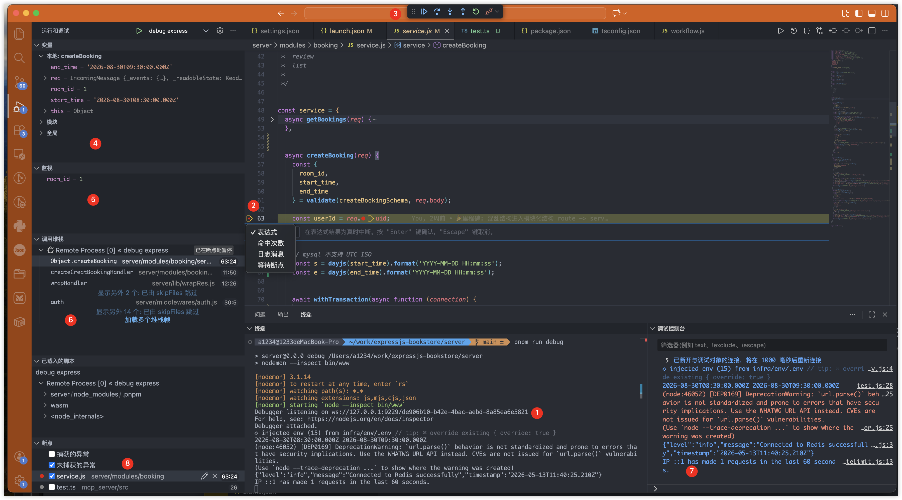

# debug 复盘

## 核心流程 (debug 客户端去连 debug 服务端)
1. nodejs 开启 debug 服务进层， 如1
2. vscode 开启 debug 客户端去连接，如 attach 模式，连哪个端口等等。


## vscode debug 客户端看板
1. nodejs 开启 debug 服务
2. 设置断点
  - 2.1 表达式断点 v === 5，类似代码里
    ```
      if xxx === yyy
        debugger
    ```
  - 2.2 命中次数断点 >= 5，用于循环，类似代码里
    ```
      let count = 0
      for
        if count === 5
          debugger;
      count++
    ```
3.调试模式
  - 3.1 step over, 执行完当前，跳过函数，执行下一步。
  - 3.2 step in/out, 类似函数入栈/出栈查看

4.当前断点作用于链里的变量

5.监听变量，如 room_id，可在循环里查看变量值

6.调用的堆栈，通过配置过隐藏（灰色）掉 node_modules 里的堆栈，注意尽可能用命名函数，避免匿名函数都是同一个名字，难追踪。

7.调试控制台，可以读变量，执行当作用域里的函数，如我想试试 dayjs 的某个 API，或者打印某个值
```
dayjs.yyy()
```

8.断点位置
- 捕获的断点，就是 catch 掉的 throw error 也要捕捉，尽量不开启这个，否则会污染 debug，很多三方库都 catch 掉的。
- 未捕捉的断点，就是 throw 出来的，但未 catch 处理，就会捕捉上。


## debug协议流程, 一句话：客户端发送断点方法给服务端，服务端返回断点信息给客户端，客户端显示在 UI 上。
### debug 客户端
debug 客户端会把断点位置（method: Debugger.paused），文件路径，断点行列等信息发送给 debug 服务端。然后 debug （method: Debugger.yyy）的动作也会发送过去


### debug 服务端
当命中断点后，会把命中时代码执行上下文如调用堆栈，作用域链等信息发送给客户端，客户端显示在 UI 上。


要记住 js runtime 只执行 js 代码，其他的不认识。

但目前有众多的中间编译：如 ts，编译会产生 sourcemap 文件，与源文件代码是一种映射关系

当客户端在 xxx.ts 文件的 10 行打断点时，客户端会解析 sourcemap, 解析对应编译后的文件断点信息发送给 debug 服务端，如:

```
parseLocation({file: 'xxx.ts', line: 10})
=> 输出
// 这是 debug 客户端发送给服务端的
{file: 'xxx.js', line: 20}
```

debug 服务端命中断点后，返回给客户端，客户端再解析出对应的源文件，行，以及上下文等显示在客户端 UI 上。

一句话：debug 客户端会解析源文件的断点位置，输出真实文件的断点位置，发送给服务端。


## 坑
vscode 有时候命中断点无法命中 await for of
解决方案 if couter === 10 debugger; 强制命中


