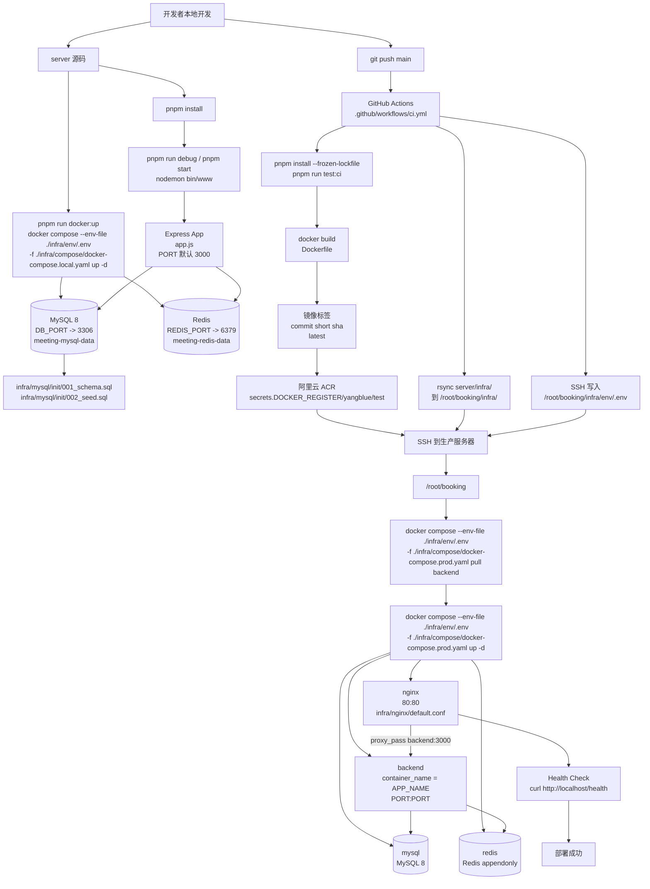
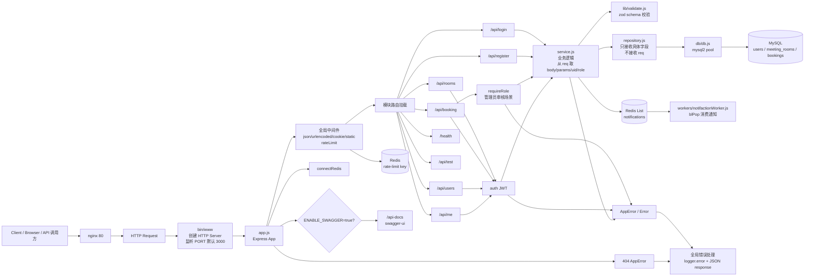
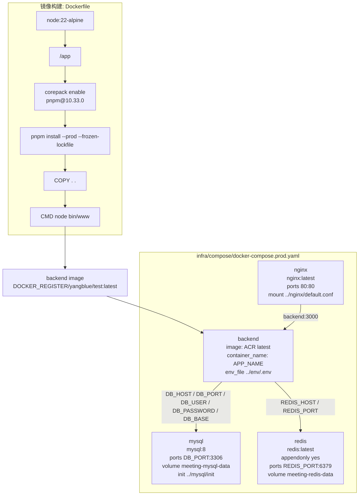
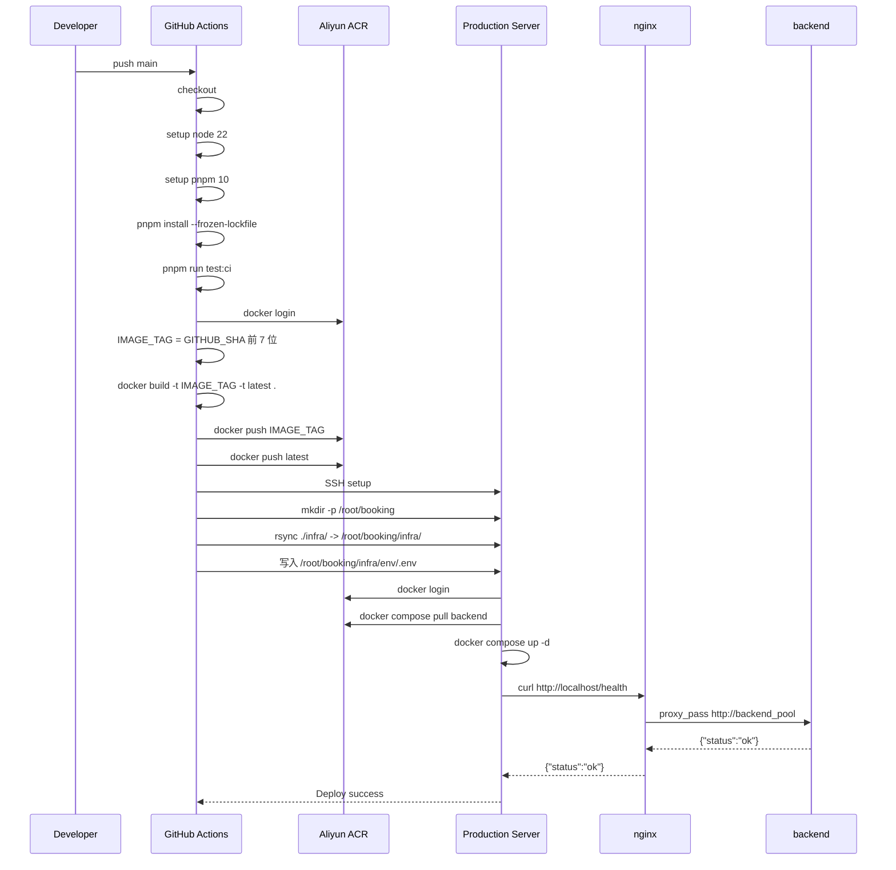

# Server 开发到部署架构图

> 基于当前 `server` 目录代码、`infra/*`、`Dockerfile`、`package.json` 和仓库根目录 `.github/workflows/ci.yml` 整理。

## 1. 整体开发到部署流程

## 2. 应用内部请求链路

## 3. Docker 与生产运行拓扑

## 4. CI/CD 关键步骤

## 5. 当前架构要点

- 本地开发：`pnpm run docker:up` 使用 `infra/compose/docker-compose.local.yaml` 启动 MySQL 和 Redis，Node 服务在宿主机通过 `pnpm run debug` 或 `pnpm start` 启动。
- 生产部署：`infra/compose/docker-compose.prod.yaml` 编排 `nginx`、`backend`、`mysql`、`redis`；nginx 对外暴露 `80`，反代到 compose 网络内的 `backend:3000`。
- CI/CD：`main` 分支 push 后先跑 Vitest，再构建并推送 Docker 镜像，然后同步 `server/infra/` 到服务器，写入远程 `infra/env/.env`，最后只 `pull backend` 并 `up -d`。
- 环境变量：真实 `infra/env/.env` 不提交 Git；生产由 CI 使用 GitHub Secrets 写入服务器。`DB_PASSWORD`、`JWT_SEC` 等敏感值放 Secrets。
- 初始化 SQL：`infra/mysql/init/*.sql` 可以提交仓库，并通过 compose 挂载到 `/docker-entrypoint-initdb.d/`；这些 SQL 只会在 MySQL 数据目录首次初始化时执行。
- 健康检查：生产环境通过 nginx 访问 `http://localhost/health`，返回 `{"status":"ok"}` 才认为部署成功。
- 分层约定：`routes` 统一把 `req` 传给需要请求上下文的 `service`；`service` 负责取 `body/params/uid/role` 和业务判断；`repository` 只接收具体字段，不接收 Express `req`。
- Redis 用途：应用启动时连接 Redis；全局限流中间件写入 `rate-limit:*`；预约创建后向通知队列 `notifications` 写入消息；Worker 使用 `blPop` 消费。
- Swagger：只有 `ENABLE_SWAGGER=true` 时才挂载 `/api-docs`，生产 `.env` 建议设为 `false`。
