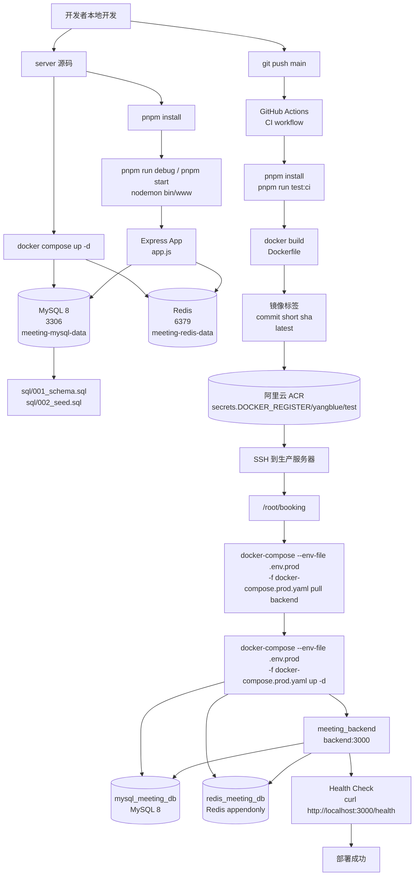
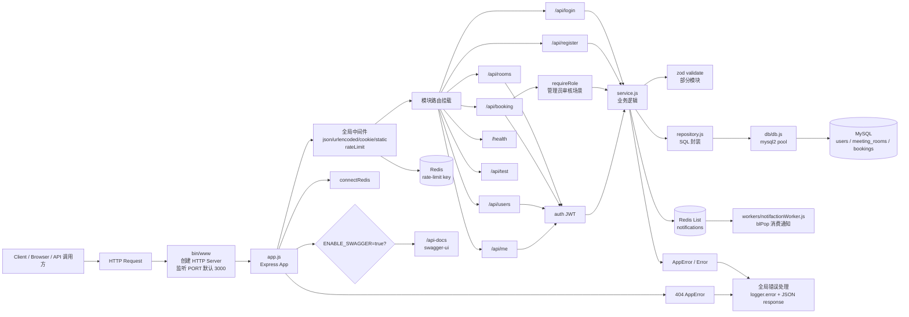
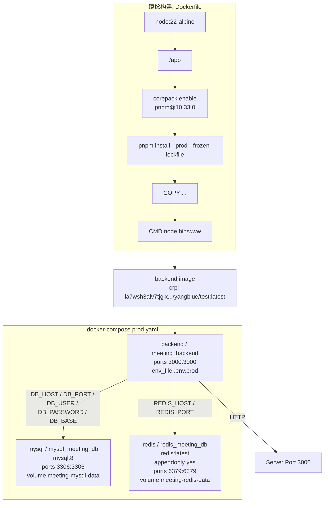
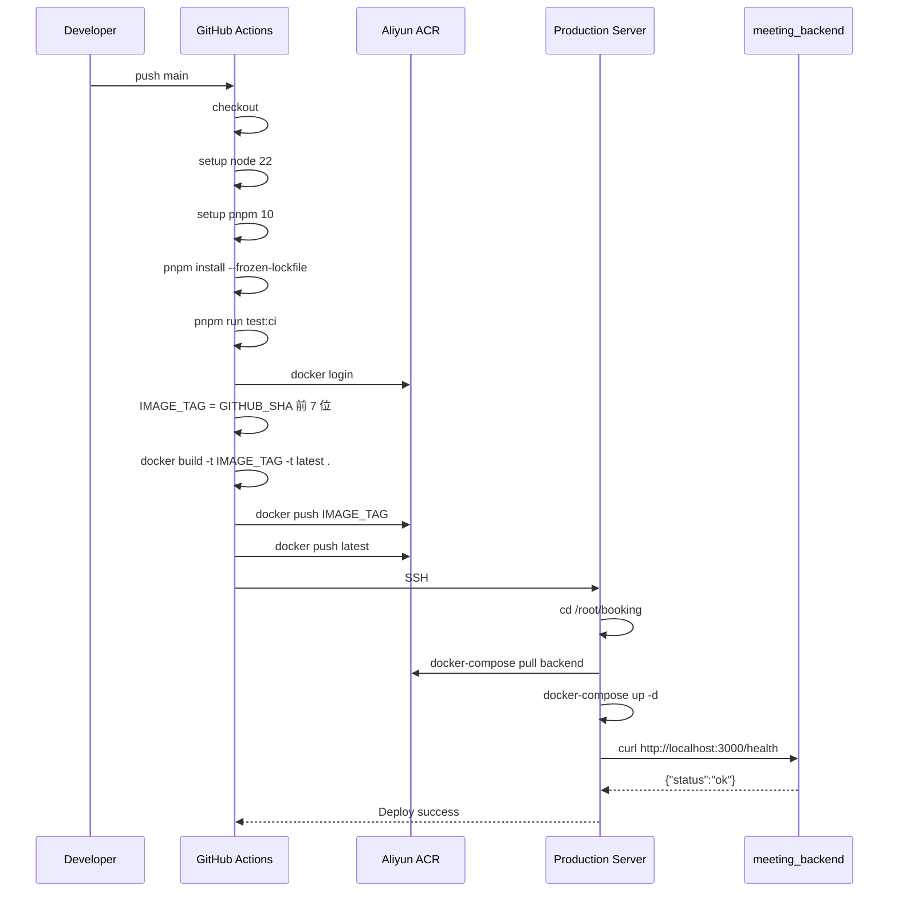

# Server 开发到部署架构图

> 基于当前 `server` 目录代码、`Dockerfile`、`docker-compose.yml`、`docker-compose.prod.yaml` 和 `.github/workflows/ci.yml` 整理。

## 1. 整体开发到部署流程

## 2. 应用内部请求链路

## 3. Docker 与生产运行拓扑

## 4. CI/CD 关键步骤

## 5. 当前架构要点

- 本地开发：`docker-compose.yml` 只启动 MySQL 和 Redis，Node 服务在宿主机通过 `pnpm run debug` 或 `pnpm start` 启动。
- 生产部署：`docker-compose.prod.yaml` 使用远程镜像启动 `backend`，同时编排 MySQL 和 Redis。
- CI/CD：只在 `main` 分支 push 时触发，先跑 Vitest，再构建并推送 Docker 镜像，最后 SSH 到服务器拉镜像并重启容器。
- 健康检查：部署后访问 `http://localhost:3000/health`，返回 `{"status":"ok"}` 才认为成功。
- Redis 用途：应用启动时连接 Redis；全局限流中间件写入 `rate-limit:*`；预约创建后向通知队列 `notifications` 写入消息；Worker 使用 `blPop` 消费。
