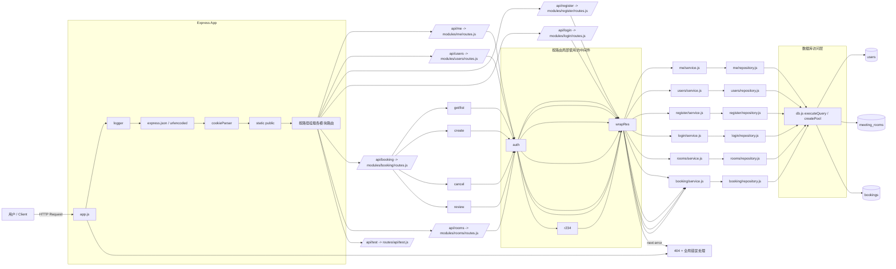
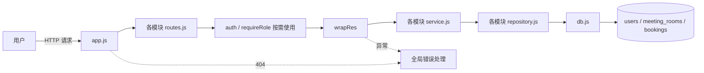

```mermaid
flowchart LR
      U[用户 / Client] -->|HTTP Request| APP[app.js]

      subgraph Global["Express App"]
          APP --> MW1[logger]
          MW1 --> MW2[express.json / urlencoded]
          MW2 --> MW3[cookieParser]
          MW3 --> MW4[static public]
          MW4 --> ROUTES[按路径挂载各模块路由]
      end

      ROUTES --> ME_R[/api/me -> modules/me/routes.js/]
      ROUTES --> USERS_R[/api/users -> modules/users/routes.js/]
      ROUTES --> REGISTER_R[/api/register -> modules/register/routes.js/]
      ROUTES --> LOGIN_R[/api/login -> modules/login/routes.js/]
      ROUTES --> BOOKING_R[/api/booking -> modules/booking/routes.js/]
      ROUTES --> ROOMS_R[/api/rooms -> modules/rooms/routes.js/]
      ROUTES --> TEST_R[/api/test -> routes/api/test.js/]

      subgraph Middlewares["按路由局部使用的中间件"]
          AUTH[auth]
          ROLE[r234]
          WRAP[wrapRes]
      end

      ME_R --> AUTH --> WRAP --> ME_S[me/service.js]
      USERS_R --> AUTH --> WRAP --> USERS_S[users/service.js]
      REGISTER_R --> WRAP --> REGISTER_S[register/service.js]
      LOGIN_R --> WRAP --> LOGIN_S[login/service.js]
      ROOMS_R --> AUTH --> WRAP --> ROOMS_S[rooms/service.js]

      BOOKING_R --> B1[get/list]
      BOOKING_R --> B2[create]
      BOOKING_R --> B3[cancel]
      BOOKING_R --> B4[review]

      B1 --> AUTH --> WRAP --> BOOKING_S[booking/service.js]
      B2 --> AUTH --> WRAP --> BOOKING_S
      B3 --> AUTH --> WRAP --> BOOKING_S
      B4 --> AUTH --> ROLE --> WRAP --> BOOKING_S

      ME_S --> ME_REPO[me/repository.js]
      USERS_S --> USERS_REPO[users/repository.js]
      REGISTER_S --> REGISTER_REPO[register/repository.js]
      LOGIN_S --> LOGIN_REPO[login/repository.js]
      ROOMS_S --> ROOMS_REPO[rooms/repository.js]
      BOOKING_S --> BOOKING_REPO[booking/repository.js]

      subgraph DBLayer["数据库访问层"]
          DB[db.js executeQuery / createPool]
      end

      ME_REPO --> DB
      USERS_REPO --> DB
      REGISTER_REPO --> DB
      LOGIN_REPO --> DB
      ROOMS_REPO --> DB
      BOOKING_REPO --> DB

      DB --> USERS_T[(users)]
      DB --> ROOMS_T[(meeting_rooms)]
      DB --> BOOKINGS_T[(bookings)]

      APP --> ERR[404 + 全局错误处理]
      WRAP -->|next error| ERR
```

```mermaid
flowchart LR
    U[用户] -->|HTTP 请求| APP[app.js]
    APP --> ROUTE[各模块 routes.js]
    ROUTE --> MW[auth / requireRole 按需使用]
    MW --> WRAP[wrapRes]
    WRAP --> SERVICE[各模块 service.js]
    SERVICE --> REPO[各模块 repository.js]
    REPO --> DB[db.js]
    DB --> TABLES[(users / meeting_rooms / bookings)]
    WRAP -. 异常 .-> ERR[全局错误处理]
    APP -. 404 .-> ERR
```